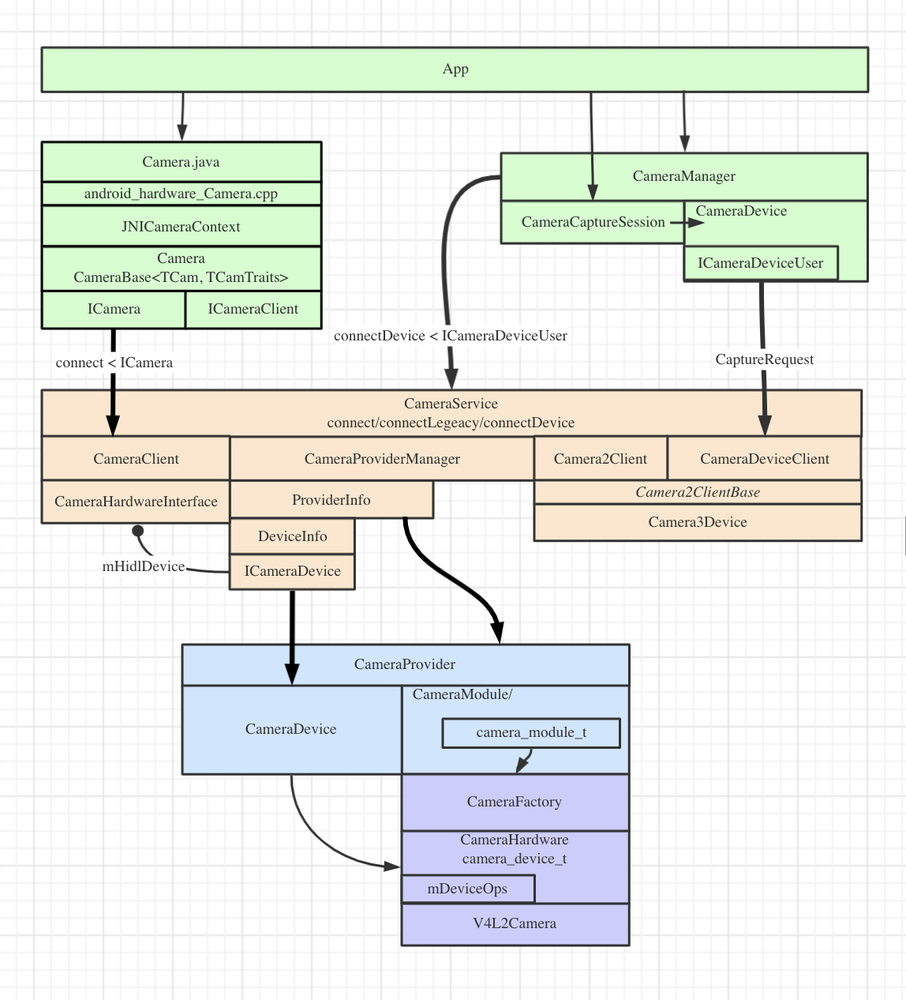
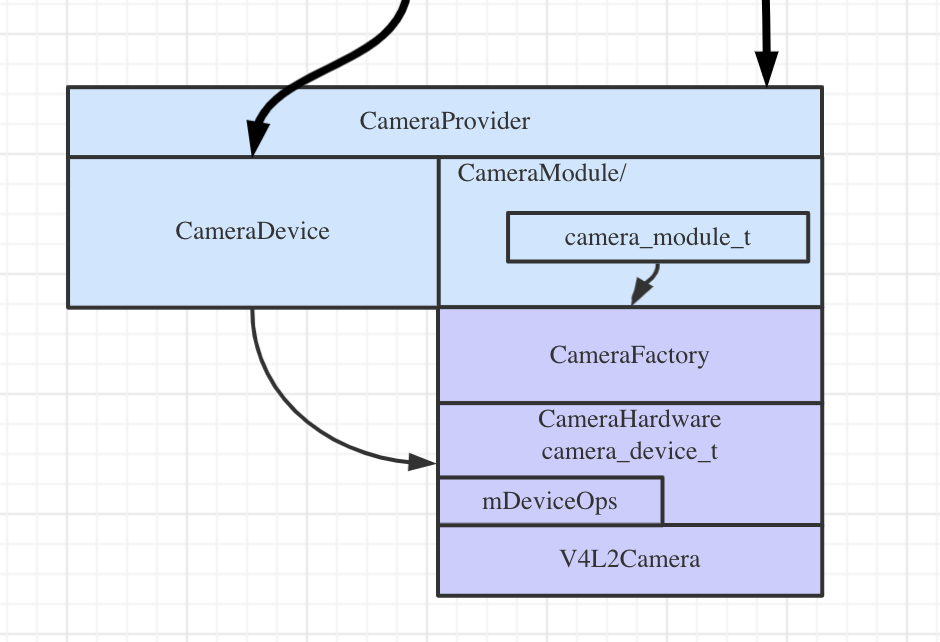
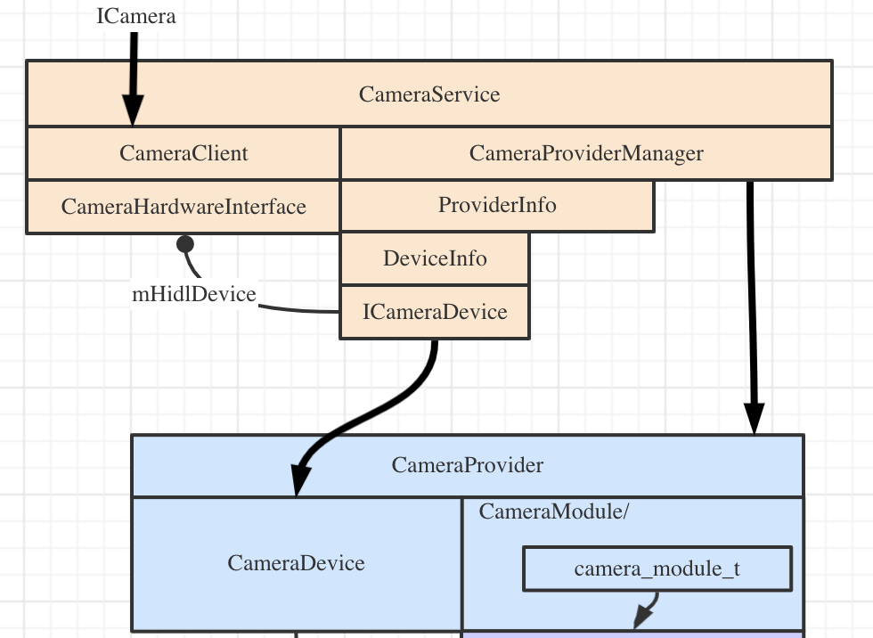

## 有哪些进程：

```
x86_64:/ # ps -ef | grep camera
cameraserver   911     8 0 11:43:41 ?     00:00:00 android.hardware.camera.provider@2.4-service
cameraserver   927     8 0 11:43:41 ?     00:00:00 cameraserver
```




### android.hardware.camera.provider@2.4-service

这个进程功能是加载实现了摄像头功能的hal 模块，封装成一些接口给 `cameraserver` 进程使用。它主要封装了2类接口: 

* `ICameraProvider` ，实现是 `CameraProvider`， 用来获取所有的摄像头信息，比如获取摄像头个数，某个摄像头的信息/接口、等；
* `ICameraDevice`， 实现是 `CameraDevice`， 用来与特定的摄像头交互，比如open、startPreview等；

下图是这个进程的主要模块，有2部分组成，一个是进程主模块 `/system/vendor/bin/hw/android.hardware.camera.provider@2.4-service` 相关代码在  `hardware/interfaces/camera` ; 另外一个是摄像头实现的模块也就是 hal 模块 `/system/lib64/hw/camera.x86.so` 。



它是 init 启动的，启动配置文件在

```
hardware/interfaces/camera/provider/2.4/default/android.hardware.camera.provider@2.4-service.rc
```
进程的入口方法在：
```
hardware/interfaces/camera/provider/2.4/default/service.cpp
```

进程启动后就开始加载 hal 模块， 在 android-x86 上，加载的就是 `/system/lib64/hw/camera.x86.so`，每个装载的 hal 模块由对应的 `CameraModule` 封装，它只负责打开、初始化、获取摄像头个数，获取某个摄像头信息。

### hal（/system/lib/libcamera.so） 的实现

```
hardware/libcamera/CameraHal.cpp

camera_module_t HAL_MODULE_INFO_SYM = {
    .common = {
        .tag           = HARDWARE_MODULE_TAG,
        .version_major = 1,
        .version_minor = 0,
        .id            = CAMERA_HARDWARE_MODULE_ID,
        .name          = "Camera Module",
        .author        = "The Android Open Source Project",
        .methods       = &android::CameraFactory::mCameraModuleMethods,
        .dso           = NULL,
        .reserved      = {0},
    },
    .get_number_of_cameras = android::CameraFactory::get_number_of_cameras,
    .get_camera_info       = android::CameraFactory::get_camera_info,
};
```

`CameraFactory` 在初始化时解析 `/etc/camera.cfg` 配置文件。 配置文件中的每一行代表一个摄像头：

`front|back $location $orientation`

* `front|back` 标识是前置还是后置摄像头；
* `$location` 指向真正实现的驱动文件。 
* `$orientation` 默认的方向；

解析配置时，每个摄像头都会有 `camera_id` 的编号，它从0开始，从配置文件上到下依次递增。
每个摄像头用 `CameraHardware` 封装，`CameraHardware`  有个静态成员变量 `mDeviceOps`，`mDeviceOps` 包含了操作摄像头的所有接口，外部的 `CameraDevice` 通过 `CameraModule` 打开对应 `camera_id` 并获取到这个 `camera_id` 对应的 `CameraHardware`（其实是它的子类`camera_device`），这样 `CameraDevice` 就是可以通过 `mDeviceOps` 来操作摄像头了。


## /system/bin/cameraserver

这个服务进程的主要作用是管理 provider，并把这些 provider 所提供的摄像头功能中转给app使用。



`CameraProviderManager` 监听 `provider`服务的注册， 每个 provider 由`ProviderInfo`封装。`ProviderInfo` 通过持有 `ICameraProvider` 的客户端接口来和`provider`交互。比如，通过 `ICameraProvider#getCameraIdList` 的接口，获取到它的设备名称列表， 根据每个设备的版本，为每个设备创建`DeviceInfo1` 或者 `DeviceInfo3` 保存到 `mDevices` 中。 

当 app 需要使用摄像头时，向 `CameraService` 请求连接指定的`camera_id`，`CameraService` 构建一个`CameraClient` 来受理请求。 `CameraClient` 本身不直接和hal交互，而是委托给 `CameraHardwareInterface` ， `CameraHardwareInterface` 通过 `CameraProviderManager#openSession` 获取到 hal 的接口后就可以调用摄像头的hal api了。


`cameraserver` 由 init 启动， 配置文件在，可执行程序是 `/system/bin/cameraserver`。
```
frameworks/av/camera/cameraserver/cameraserver.rc
```
入口在：
```
frameworks/av/camera/cameraserver/main_cameraserver.cpp
```

## Framework

##### 疑问
* 老接口的 CameraDevice 和新接口有什么区别
* Java 层的 Open 打开的是哪个摄像头；
* 要实现CameraModule 要做哪些事情？
* ZXing 通过Intent获取摄像头数据？


