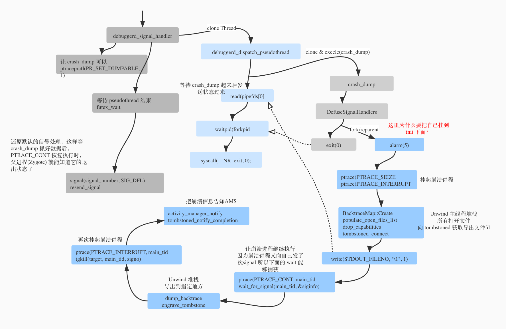

### App 退出场景

1. 主动退出
2. 调试场景对话框，对话框点击退出；AMS#killAppAtUsersRequest
3. 发生 ANR 后用户点击关闭；AMS#killAppAtUsersRequest
4. app 内部发生异常java 或者 native 崩溃；

### Native 崩溃退出场景



##### linker 给每个进程注册信号处理方法
linker 在进程启动时会调用 debuggerd_init 注册信号监听：

	```
	bionic/linker/linker_main.cpp
	
	__linker_init_post_relocation{
		debuggerd_callbacks_t callbacks = {
			.get_abort_message = []() {
		  		return g_abort_message;
			},
			.post_dump = &notify_gdb_of_libraries,
		};
		
		debuggerd_init(&callbacks);
	}
	
	```
	
信号接收的函数是： system/core/debuggerd/handler/debuggerd_handler.cpp 
 
* 当注册的信号触发时：`debuggerd_signal_handler`， 会 clone 一个线程`debuggerd_dispatch_pseudothread`;  
* `debuggerd_dispatch_pseudothread` 这个线程通过 clone 调用，创建一个进程执行：`/system/bin/crash_dump`;   
* 最后把信号的处理还原为系统默认的处理器，这样做的目的有2个: 1. 下次信号到来时确保被杀死； 2. 被杀后，父进程（Zygote）可以知道它退出的原因；

##### crash_dump 进程	

`crash_dump` 进程做了这些事情（system/core/debuggerd/crash_dump.cpp）：

1. 还原所有信号的处理方式为系统默认方式。 这样避免自己挂了又触发自己，一直死循环；
* 根据父亲的pid，崩溃进程的所有线程(/proc/$ppid/task/$siblings)；
* fork一个子进程，自己退出（相当于把自己挂到了init 下面）。这么做的目的我认为有3个：
	* 直接在崩溃进程的signal handler 里面做dump的相关事情比较容易引发信号并发问题，比如dump的代码用到了非信号安全的函数，fork 一个进程来做这个事情就避免了这个风险；
	* 把自己挂在 init 进程下面是为了让 `crash_dump` 这个进程能够调用 `waitpid` 来检测崩溃进程的状态；
	* 挂在 init 下面可以避免`crash_dump` 变成僵尸进程。 因为 init 默认会 wait 它的孩子；
* 设置一个5s的闹钟，如果超时，就放弃dump，退出；
* 接着通过 ptrace 让崩溃进程的所有线程停下来；
* 接着通过pipe 发消息给 `debuggerd_dispatch_pseudothread`（它在崩溃进程） 让它知道crash_dump 开始工作了。
	`debuggerd_dispatch_pseudothread` 线程收到消息后，把`crash_dump_started`设为true后就退出了；
* dump 崩溃进程的所打开的文件； 也就是 /proc/$pid/fd 文件夹下面的所有软连接指向的文件。
* 向 tombstoned 发送消息，tombstone 返回一个文件句柄，dump信息就往这里写，为啥要这么麻烦？因为 crash_dump 进程没有权限访问 `/data/tombstones/` 这个目录；
* 然后通过 `ptrace(PTRACE_CONT, main_tid, 0, 0)` 恢复崩溃进程的主线程，自己在等它触发信号：`wait_for_signal(main_tid, &siginfo)`谁发这个信号呢？;
* 根据收到的信号参数，决定导出堆栈信息还是dump 完整的tombstone信息。这里的信号可能是 `debuggerd` 发过来的，有关 `debuggerd` 的使用，看下面。默认是导出完整的 tombstone 信息；
* 再通过 ptrace 让崩溃进程继续运行，并把信号再发给它，这样崩溃进程再次接收到信号就会退出了；
* 最后崩溃信息(pid,signal, 等)通过 socket 通知 AMS， 到此 `crash_dump` 的事情做完了；

##### AMS 处理崩溃	

代码在： frameworks/base/services/core/java/com/android/server/am/NativeCrashListener.java

1. 解析崩溃信息： pid, signal 和 reportData。根据 pid 找到对应的 ProcessRecord，把这些新封装成一个 CrashInfo 发送给 AMS 处理；
* AMS 首先往 logcat 的 events 缓存写条日志, 通过 logcat -b events 可以查看，类似这样：
	```
	08-17 06:32:26.764   645 61488 I am_crash: [645,0,com.summer.demo.crashsdkdemo,954777414,Native crash,Segmentation fault,unknown,0]
	```
* 接下来再把崩溃信息传递给 `DropBoxManagerService`， 这部分后面再说；
* 接下来 调用 AppErrors#crashApplication 处理。 

##### DropBoxManagerService 处理崩溃

* 在AMS#handleApplicationCrashInner，时根据崩溃进程分类为 `system_server` `system_app` 和 `data_app` 3个类别。然后再补充一些信息，比如是否前台，对应 Activity 的及其父 Activity 信息、系统Build指纹信息等。最后会把这个消息发送到 DropBoxManagerService；
* DropBoxManagerService 收到崩溃信息后， 判断这类崩溃是否需要记录，判断依据是系统设置项有没有打开，开关是，对应的设置项保存在： /data/system/users/0/settings_global.xml

	```
	"disabled".equals(Settings.Global.getString(
                    mContentResolver, Settings.Global.DROPBOX_TAG_PREFIX + tag));
	```
* 最终 DropBoxManagerService 会把崩溃信息保存到 /data/system/dropbox/ 目录下面，然后发送一个这样的系统广播：
	
	```
	final Intent dropboxIntent = new Intent(DropBoxManager.ACTION_DROPBOX_ENTRY_ADDED);
	dropboxIntent.putExtra(DropBoxManager.EXTRA_TAG, tag);
	dropboxIntent.putExtra(DropBoxManager.EXTRA_TIME, time);
	```

##### debuggerd

* 通过 `/system/bin/debuggerd` 这个命令，可以导出指定进程的tombstone信息；
* `debuggerd` 通过向指定进程发送信号 DEBUGGER_SIGNAL ， `crash_dump` 捕获信号后导出堆栈信息；
* 


### java 崩溃退出
`ZygoteConnection` 收到app启动消息后，通过 `Zygote.forkAndSpecialize` fork 出app进程，然后注册虚拟机异常处理器：
	 
```	
ZygoteConnection#processOneCommand
ZygoteConnection#handleChildProc
ZygoteInit#zygoteInit 
RuntimeInit#commonInit
	Thread.setUncaughtExceptionPreHandler(new LoggingHandler());
   	Thread.setDefaultUncaughtExceptionHandler(new KillApplicationHandler());
```

`KillApplicationHandler` 先调用 AMS 做临死前的处理，比如清理Activity/Service 等组件信息以及这些组件关联的其他进程。 临死前的事情处理完后，再杀app进程：

```
private static class KillApplicationHandler implements Thread.UncaughtExceptionHandler {
	public void uncaughtException(Thread t, Throwable e) {
		try{
			ActivityManager.getService().handleApplicationCrash(
                        mApplicationObject, new ApplicationErrorReport.ParcelableCrashInfo(e));
       } catch (...) {...}
       } finally{
			Process.killProcess(Process.myPid());
			System.exit(10);
       }
	}
}
```

AMS 的处理流程和之前的 Native的崩溃处理流程一样：

```
AMS#handleApplicationCrash
handleApplicationCrashInner
	EventLog.writeEvent
	addErrorToDropBox
	mAppErrors.crashApplication
		mService.mStackSupervisor.handleAppCrashLocked
```

等app进程死了之后， AMS#appDiedLocked 会继续做一些死后的清理工作。 appDiedLocked 是 app 进程出生时通过 attachApplication 注册的 binder 死亡通知触发的。

```
AMS#appDiedLocked
AMS#handleAppDiedLocked
mStackSupervisor#handleAppDiedLocked
```

#### Art 信号处理

* `app_process` 会静态链接 `libsigchain.so`;
* art 里面有个静态变量 `FaultManager fault_manager;` 定义在 fault_handler.cc ，它的构造函数会先获取 `SIGSEGV` 的处理放到 `oldaction_` 保存；
* `sigchain` 初始化， 通过 `dlsym` 获取到libc 里面的 `sigaction` 函数地址，保存到 `linked_sigaction`，后面app的 sigaction 调用将被sigchain 里面的 sigaction 拦截；
* runtime 初始化时 调用 `fault_manager.Init();` 再调用 `AddSpecialSignalHandlerFn` 拦截 `SIGSEGV` 信号。 
* app 进程启动，初始化 nativebridge 时，也会调用 `AddSpecialSignalHandlerFn` 做信号(7/11)拦截；


