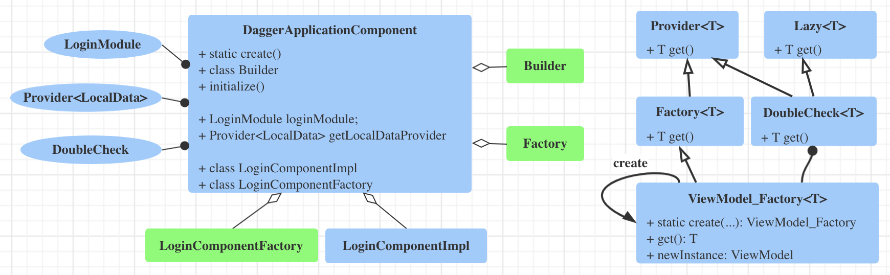

### Dagger

#### 学习资料

* [android-dev](https://developer.android.com/training/dependency-injection/dagger-android)
* [codelabs](https://codelabs.developers.google.com/codelabs/android-dagger/#0)
* [dagger-android](https://dagger.dev/dev-guide/android.html)

#### 依赖
	
* 什么是依赖？举个例子：当你写一个```Activity``` 你需要把一些数据写入数据库，这时你一般会再写个 DatabaseMgr 来实现这个功能能。 这样你的这个 ```Activity``` 将依赖 ```DatabaseMgr``` 来实现读写数据库的功能， ```DatabaseMgr``` 也就成为了 ```Activity``` 的依赖。

* 获取依赖的3种方式
	1. The class constructs the dependency it needs.
	2. Grab it from somewhere else. Some Android APIs, such as Context getters and getSystemService(), work this way.
	3. Have it supplied as a parameter. 
		
	The third option is dependency injection! With this approach you take the dependencies of a class and provide them rather than having the class instance obtain them itself.
	
* 既然依赖以参数形式注入，那么构建一个依赖链路很深的对象就特别麻烦，Dagger 为我们提的自动构建依赖。
* 我们需要通过各种注解告诉 Dagger 三种信息：
	1. 谁依赖谁？通过 ```@Component``` 定义依赖图，Dagger 以这个为根节点，递归解析从它的依赖，它的依赖的依赖, 它依赖的依赖的依赖... 并生成代码来构建这些依赖。
		
		```
		A @Component interface gives the information Dagger needs to generate the graph at compile-time. The parameter of the interface methods define what classes request injection.
		```
		
	2. 如何构建依赖？有2种方式：
		* 通过```@Inject``` 注解依赖的构造方法；
			
			```
			class LoginViewModel @Inject constructor() { ... }
			```
			
		* 在 ```@Module``` 里实现依赖的构建，并用 ```@Provider``` 或者 ```@Binds``` 注解；
			
			```
			@Module
			class LoginModule {
			
			    @Provides
			    fun getLocalData(): LocalData{
			        return LocalData()
			    }
			}
			```
			
			```
			@Module
			abstract class StorageModule {
	
			    @Binds
			    abstract fun provideStorage(storage: SharedPreferencesStorage): Storage
			}
			```
			
			```@Binds``` 其实本身并不构建依赖，只是在需要构建一个接口的实现时，告诉 Dagger 用特定的某个实现罢了； 
		
	3. 如何管理依赖对象的生命周期？ Use ```@Scope``` to scope a type to the Component's lifecycle. 如果这个依赖是通过 ```@Provider``` 创建的，那么要注解 ```@Provider``` 的方法，而不是这个依赖

####  ```@Component```、```@Module``` 和 ```@Subcomponent``` 之间的关系

* ```Component``` 是个接口或者抽象类，它的生命周期一般和 ```Application``` 对应，Dagger 会生成代码实现它，我们就可以用这个类来获取（或者注入）依赖，或者获取它的 ```Subcomponent``` 来获取（或者注入）依赖；
	
* ```Module``` 是普通或者抽象类，用来给它所属的 ```Component```/```Subcomponent``` 提供特殊依赖的构建；
		
	```
	Similar to Components, Dagger Modules tell Dagger how to provide instances of a certain type. Dependencies are defined using the @Provides and @Binds annotations.
	```
		
* ```Subcomponent``` 和 ```Component``` 的功能类似，只是它从属于 ```Component``` ，必须通过 ```Component``` 来使用它。 Dagger 在编译时会生成 ```Subcomponent``` 的实现并作为 ```Component``` 的实现类的内部类，因此 ```Subcomponent``` 可以获取到 ```Component``` 所提供其他依赖；

* ```SubComponent``` 不能直接挂在```Component``` 上， 需要定义个 ```Module``` 承载它，然后再把```Module``` 挂到 ```Component```上:
	
	
	```
	@Subcomponent
	interface LoginComponent { ... }
	

	@Module(subcomponents = LoginComponent::class)
	class SubcomponentsModule { ... }

	@Component(modules = [SubcomponentsModule::class])
	interface ApplicationComponent { ... }
```


* ```Module``` 一般在同一个 Component 里面只定义一次；

	Good practice dictates that modules should only be declared once in a component (outside of specific advanced Dagger use cases).


#### Dagger 生成代码



* Dagger 为 ```Component``` 生成 ```Dagger$Component``` 类，该类实例通过静态方法 create 以 ```Builder``` 的方式创建；

* ```Dagger$Component``` 的成员变量有2类：
	* 被 ```@Module``` 注解的类， 因为这种类定义了如何获取依赖，所以当然得持有它；
	* ```Provider```， 用来生产依赖，如果依赖生命周期和当前 ```Component``` 相同， 就用 ```DoubleCheck``` 做缓存，这样每次就不会生产新的依赖；
	
* ```Dagger$Component``` 有3种内部类
	* ```Subcomponent``` 的实现类，内部类可以访问外部类的成员变量，因此 ```Subcomponent``` 可以获取到所有 ```Component``` 可以获取到的依赖。 
	* 其他2种分别是用以创建自己的 ```Factory``` 工厂类或者 ```Builder``` 类，这2种方式都是用来创建 ```Dagger$Component``` 自身，因此没有必要2者都同时存在，有了 ```Factory``` 就不会有 ```Builder``` 。```Factory```和```Builder``` 可以通过 ```@Component.Factory``` 和 ```@Component.Builder``` 来显示定义。对于 ```Component``` 一般可以不用显示定义它的 ```Factory```或者```Builder```，但 ```SubComponent``` 一般都需要显示定义它的```Factory```; 原因如下：

		* 因为使用者不能直接使用```Subcomponent```，使用者必须通过 ```Dagger$Component``` 来获取它的实例，而 ```Dagger$Component``` 获取 ```Subcomponent``` 的实例也是通过 ```Subcomponent``` 的```Factory```（或```Builder```），如果 ```Subcomponent``` 没有显示定义， ```Component``` 不清楚隐式的（也就是将要生成的默认的）```Factory``` 或 ```Builder``` 具体是什么样的，也就不好生成对应的代码。（其实我认为 Dagger 应该是要知道的，因为代码都是它自己生成的）
		* 使用者要通过 ```Component``` 获取 ```Subcomponent``` 的实例，就需要在 ```Component``` 里定义好获取 ```Subcomponent``` 的实例接口或者生成 ```Subcomponent``` 的```Factory```(```Builder```), 对于前者，缺乏可扩展性，所以 Dagger 选择了后者。 但 ```Subcomponent``` 的 ```Factory``` 和 ```Builder``` 将会是什么样的？ 一种情况是隐式生成的，这就要在生成完隐式的 ```Factory``` 代码然后把它定义在 Component 里面，但 Subcomponent 代码生成又依赖 ```Component``` 的代码生成，代码生成过程会出现互相依赖的死循环。另外一种情况是显式定义的 ```Factory```, 这样就可以避免死循环依赖了，所以需要显示定义 ```Subcomponent``` 的 ```Factory``` 或者 ```Builder```。
	
* ```Subcomponent``` 的生成代码，将和 ```Component``` 生成的代码类似，这样就可以实现模块之间的嵌套；

#### Dagger For Android

* 在 app 中，依赖根节点一般是 ```Application```、```Activity``` 和 ```Fragment```，比如在Activity 里面有个依赖需要注入，而这些对象是在 Framework 层构建的，所以这些对象的依赖需要手动调用 Dagger 来实现，比如在 ```Application#onCreate```, ```Activity#onCreate```, ```Fragment#onAttach``` ;

	在 Activity 或者 Fragment 比较多的情况下，会重复很多类似下面这样的代码片段：
	
	```
	(application as MyApplication).appComponent.loginComponent().create().inject(this)
	```
	
	这样的代码有几个问题：
	* 重复
	* 依赖使用者需要知道依赖是怎么注入的，通过 applicaiton 转换为 MyApplication 在拿到 loginComponent 的 Factory 创建一个 Subcomponent，然后调用它的 inject 方法。 这样一系列的操作，对依赖使用者来说太不透明了。
	
	那有没有办法定义一个 BaseActivity 或者 BaseFragment，在这里执行一次注入，并且注入过程对于使用者来说是透明的呢？那就要用到 ```AndroidInjector``` ，先说一下使用方式，然后再解释一下原理：

##### 使用方法
		
总共有 4 个步骤

1. ```Application``` 类实现 ```HasAndroidInjector```接口：

	```
	class MyApplication: Application(), HasAndroidInjector{

	    @Inject
	    lateinit var dispatchingAndroidInjector: DispatchingAndroidInjector<Any>
	
	    override fun androidInjector(): AndroidInjector<Any> {
			return dispatchingAndroidInjector;
	    }
	
	    override fun onCreate() {
			super.onCreate()
			DaggerApplicationComponent.create().inject(this)
	    }
	}
	```
2. 在 ```Component``` include 内置的 ```AndroidInjectionModule ``` ：
	
	```
	@Component(modules = [AndroidInjectionModule::class, ...])
interface ApplicationComponent {
		...
	}
	```	
	
3. 给 ```Activity``` 定义一个 Subcomponent：
	
	```
	@Subcomponent
	interface LoginComponent2: AndroidInjector<LoginActivity> {
	
	    @Subcomponent.Factory
	    interface Factory: AndroidInjector.Factory<LoginActivity> {}
	}

	@Module(subcomponents = [LoginComponent2::class])
	abstract class LoginModule2{
	
	    @Binds
	    @IntoMap
	    @ClassKey(LoginActivity::class)
	    abstract fun provideLoginComponent2Factory(f: LoginComponent2.Factory): AndroidInjector.Factory<*>
	}
	```
	
4. 把```LoginModule2``` include 到 ```Component```中后，就可以在 ```BaseActivity``` 中注入它的子类了：
	
	```
	abstract class BaseActivity: Activity() {
	
	    override fun onCreate(savedInstanceState: Bundle?) {
	        AndroidInjection.inject(this)
	        super.onCreate(savedInstanceState)
	    }
	}
	```

	以后新加的 Activity ，只要它继承 ```BaseActivity``` , 并定义好它自己的 ```Subcomponent``` 和 ```Module``` ，就可以实现依赖的自动注入了；

第 3 步骤，给每个 Activity 定义 ```Subcomponent``` 和 ```Module``` 还是比较繁琐的，用 ```@ContributesAndroidInjector``` 就可以让 Dagger 自动为我们生成 ```Subcomponent``` 和 ```Module```:
	
```
@Module
abstract class ActivityModule {
	
    @ContributesAndroidInjector
    abstract fun loginActivity(): LoginActivity
}
```
Dagger 会生成如下代码（基本和手动写的差不多）
	
```
@Module(subcomponents = ActivityModule_LoginActivity.LoginActivitySubcomponent.class)
public abstract class ActivityModule_LoginActivity {
  private ActivityModule_LoginActivity() {}
	
  @Binds
  @IntoMap
  @ClassKey(LoginActivity.class)
  abstract AndroidInjector.Factory<?> bindAndroidInjectorFactory(
      LoginActivitySubcomponent.Factory builder);
	
  @Subcomponent
  public interface LoginActivitySubcomponent extends AndroidInjector<LoginActivity> {
    @Subcomponent.Factory
    interface Factory extends AndroidInjector.Factory<LoginActivity> {}
  }
}
```

##### 原理

* 通过 ```@IntoMap``` ```@ClassKey``` 注解，告诉 Dagger 用 ```LoginComponent2.Factory``` 这个 Factory 生成的 ```Subcomponent``` 来注入 ```LoginActivity```。 这样生成的 ```Dagger$Component``` 代码会建立一个 Activity 对应 Provider 的 map：

	```
	private Map<Class<?>, Provider<AndroidInjector.Factory<?>>> getMapOfClassOfAndProviderOfAndroidInjectorFactoryOf() {
    	return Collections.<Class<?>, Provider<AndroidInjector.Factory<?>>>singletonMap(LoginActivity.class, (Provider) loginActivitySubcomponentFactoryProvider);
   }
	```

* 这个 map 会被传入 ```DispatchingAndroidInjector``` 里面：
	
	```
	public final class DispatchingAndroidInjector<T> implements AndroidInjector<T> {
  		...
  		private final Map<String, Provider<AndroidInjector.Factory<?>>> injectorFactories;
  		...
  	}
	```
	
* 然后 ```AndroidInjector.inject``` 其实就是通过```DispatchingAndroidInjector.inject```来实现注入的：

	```
	public boolean maybeInject(T instance) {
    Provider<AndroidInjector.Factory<?>> factoryProvider =
        injectorFactories.get(instance.getClass().getName());
    
    	AndroidInjector.Factory<T> factory = (AndroidInjector.Factory<T>) factoryProvider.get();
		...
		AndroidInjector<T> injector = checkNotNull(
              factory.create(instance), "%s.create(I) should not return null.", factory.getClass());

		injector.inject(instance);
  }
	``` 
 
##### 使用过程注意点

* dagger、dagger-android-support 等各个插件版本要保持一致：
	
	```
	implementation 'com.google.dagger:dagger:2.27'
    kapt 'com.google.dagger:dagger-compiler:2.27'

    annotationProcessor 'com.google.dagger:dagger-compiler:2.27'
    implementation 'com.google.dagger:dagger-android-support:2.27'
    kapt "com.google.dagger:dagger-android-processor:2.27"
    ```
	

#### Disadvantages of Dagger 
 
* 学习成本高；
* 进一步限定了app的开发模式；
* 需要暴露依赖成员变量的访问属性；
* 阅读代码不方便，依赖和使用者隔离，逻辑不直观连贯；