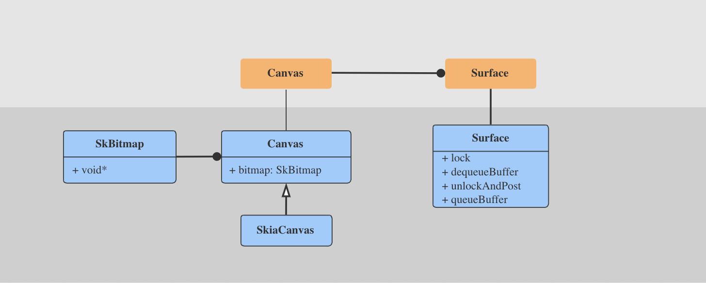

### Canvas、Surface & BufferQueue


* java 层的 Surface、 Canvas 分别对应 native 层的 Surface 和 SkiaCanvas ;
* Surface 在 lockCanvas 时，向 BufferQueue dequeue 一个 ANativeWindowBuffer，后面的图形数据将放到这里，然后把这个 ANativeWindowBuffer 用 SkBitmap 去封装，再把 SkiBitmap 赋值给 SkiaCanvas，这样 SkiaCanvas 在绘制的时候，就会把图形内容绘制到刚才那个 ANativeWindowBuffer 里面了；
* 然后 Surface#unlockCanvasAndPost 时，把刚才 dequeue 的 buffer 通过 queueBuffer 返回给 BufferQueue ，这样 sf 就可以取出来合成了；
* 其实 Surface 在 dequeueBuffer 和 enqueueBuffer 的时候还是有很多逻辑的；
* 如此看来 BufferQueue 里面的就是以bitmap 形式存在的图形数据了；
* 




### Gralloc
 
* 通过 HAL 提供， 负责打开 framebuffer 和 gpu?


### Surface

* 不论使用什么渲染API, 所有的东西最终都是渲染到 Surface. Surface代表 BufferQueue 的生产者端, 并由SurfaceFlinger所消费, 这便是基本的生产者-消费者模式.

### Layer

* Layer 是什么 和 Surface 有什么关系？

### Hardware Composer

* 介于 sf 和 Gralloc 之间，封装 gralloc 的使用，有2个任务：一方面处理 sf 委托过来的合成任务，一方面产生 vsync 新号；


### EventThread 

* 它是 sf 里面的一种线程，用来接收 vsync 信号通知，并转发；
	* 一般谁会监听vsync？


### BufferQueue

* BufferQueue 里面的数据是什么？

### Display

* 容器的显示设备宽高是 1280x720， 根据android规则：
	* 宽大于高，自然态是 landscape， portrait 对应的 rotation 是 90/270；
	* 宽小于高，自然态是 portrait ，landscape 对应的 rotation 是 90/270；
	
* Display 的初始化，  sf 初始化的时候，创建 hwc， hwc 会加载hal： fb或者 hwc , 然后把display 信息保存到 mDisplayData ， 


### GLES

```
frameworks/native/opengl
	libagl		#libGLES_android
	libs/
		EGL
		ETC
		GLES_CM		#libGLESv1_CM.so
		GLES_2		#libGLESv3 & libGLESv2
		
	
```

```
/system/lib/libGLESv1_CM.so
/system/lib/libGLESv2.so
/system/lib/libGLESv3.so
```

```
/system/vendor/lib/egl/libGLES_mesa.so #和下面这个是一样的
/vendor/lib/egl/libGLES_mesa.so 

/system/lib/egl/libGLES_android.so
```


