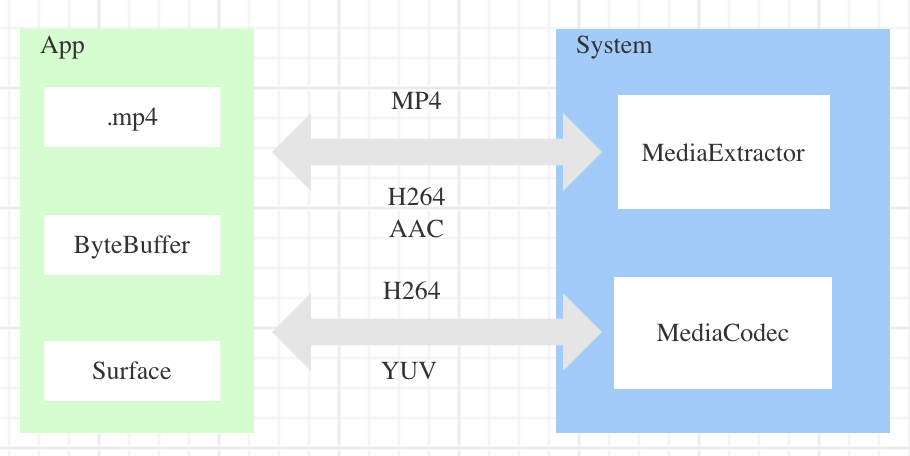
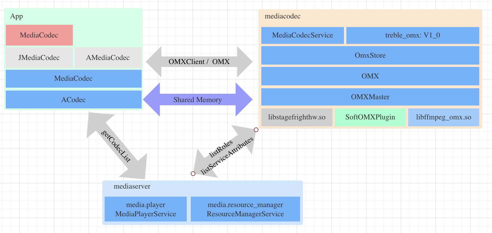

要播放一个视频文件（比如mp4），需要以下步骤：

* `demuxe` 把文件里面的视频和音频数据分别拆出来，拆解出的视频和音频一般都是编码压缩了的，所以接着要进行下一步；
* `decode` 根据视频的编码格式解码视频数据， 解码后的视频数据为裸视频格式，通常是 RGBA 或者 YUV 格式。常见的视频编码格式有 `h264` `mpeg4`； 根据音频的编码格式解码音频数据，常见的音频编码格式有 `aac`， 解码后的音频数据一般为 `pcm` 格式；
* 把裸视频数据绘制到UI， 一般是 `Surface` ， 把 `PCM` 传入??；

整体的过程如下：




从Android8开始， `MediaExtractor`和`MediaCodec` 的实现分别在 `media.extractor` 和 `media.codec` 进程中:

```
chiron:/ # ps -ef | grep media	
mediaex        876     8 0 21:23:00 ?     00:00:00 media.extractor
media          879     8 0 21:23:00 ?     00:00:00 mediaserver
mediacodec     882     8 1 21:23:00 ?     00:00:36 media.codec
```

还可以看到，还有 `mediaserver` 这个进程，后面我们会讲(@TODO)


### Demux
@TODO


### Decode

解码相关的模块交互如下图， App 通过 `mediaserver` 获取系统支持的解码器，App从中选取一个后调用 `OMX` 的Binder 接口请求创建解码组件 `OMXNodeInstance` 它实现了一套解码接口`IOMXNode` ， 后面App就是通过这个接口把编码的数据喂给解码器，解码器解码完成后把裸视频返回给App。 视频数据的传输走的是共享内存。


解码服务进程`media.codec` 在启动时会创建`OMXMaster` ， `OMXMaster` 会按顺序初始化当前系统所支持的编解码组件：

* 初始化产商的： `libstagefrighthw.so`
* 初始化Google 自己的软解: `SoftOMXPlugin`;
* 初始化系统属性`media.sf.omx-plugin`所指定的；

#### SoftOMXComponent

这里整理一下

App 在Java层通过`MediaCodec`这个Java 接口，和 mediacodec 这个服务进程通信，完成视频的解码。 解码的的流程可以分为同步和异步2种模式，同步模式的样例代码如下：

```
MediaCodec codec = MediaCodec.createByCodecName(name);
codec.configure(format, …);
MediaFormat outputFormat = codec.getOutputFormat(); 
codec.start();
for (;;) {
	int inputBufferId = codec.dequeueInputBuffer(timeoutUs);
	ByteBuffer inputBuffer = codec.getInputBuffer(...);
	... // fill inputBuffer with valid data
	codec.queueInputBuffer(inputBufferId, ...);

	int outputBufferId = codec.dequeueOutputBuffer(...);
	ByteBuffer outputBuffer = codec.getOutputBuffer(outputBufferId);
	... // outputBuffer is ready to be processed or rendered.
	codec.releaseOutputBuffer(outputBufferId, ...);
}
codec.stop();
codec.release();
```

异步模式大致如下：

```
MediaCodec codec = MediaCodec.createByCodecName(name);
codec.setCallback(new MediaCodec.Callback() {

	void onInputBufferAvailable(MediaCodec mc, int inputBufferId) {
		ByteBuffer inputBuffer = codec.getInputBuffer(inputBufferId);
		... // fill inputBuffer with valid data
		codec.queueInputBuffer(inputBufferId, ...);
	}
	
	void onOutputBufferAvailable(MediaCodec mc, int outputBufferId, …) {
		ByteBuffer outputBuffer = codec.getOutputBuffer(outputBufferId);
		... // outputBuffer is ready to be processed or rendered.
		codec.releaseOutputBuffer(outputBufferId, …);
	}
});
codec.configure(format, ...);
codec.start();
// wait for processing to complete
codec.stop();
codec.release();
```