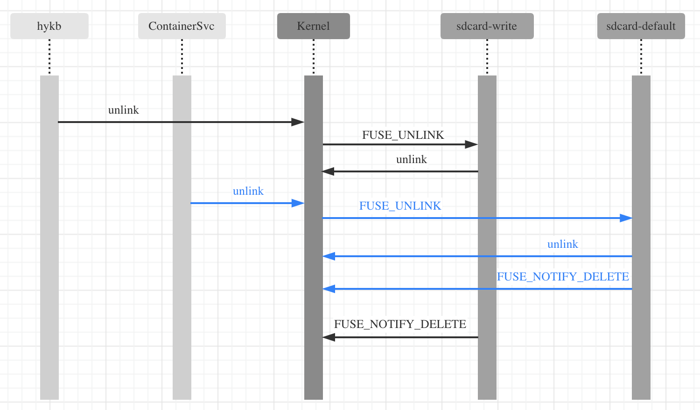

《好游快爆》 下载《方舟：生存进化》，之后再卸载，卸载后容器卡死，用户操作都无响应。接着Android 尝试重启，但重启不了，一直卡住加载页面。 `docker stop/rm` 等命令无法正常工作，容器也无法清理。

日志有报ANR 错误，查看 `/data/anr` 的日志， 发现 `system_server` 这个地方在等锁`0x0920a3d3`：


 ```
 "ActivityManager" prio=5 tid=12 Blocked
  | group="main" sCount=1 dsCount=0 flags=1 obj=0x13480640 self=0xeb2ae888b800
  | sysTid=718 nice=-2 cgrp=docker/1329214a9c6adc1eb9733f8e713c9f5edb5827d235d9e479f74a465573f29e8a sched=0/0 handle=0xeb2adb1f54f0
  | state=S schedstat=( 135117730 37441790 1774 ) utm=7 stm=5 core=22 HZ=100
  | stack=0xeb2adb0f3000-0xeb2adb0f5000 stackSize=1037KB
  | held mutexes=
  at com.android.server.StorageManagerService.isUserKeyUnlocked(StorageManagerService.java:2999)
  - waiting to lock <0x0920a3d3> (a java.lang.Object) held by thread 103
  at android.os.storage.StorageManager.isUserKeyUnlocked(StorageManager.java:1305)
  at com.android.server.am.ActivityRecord.okToShowLocked(ActivityRecord.java:2029)
  at com.android.server.am.TaskRecord.topRunningActivityLocked(TaskRecord.java:1146)
  at com.android.server.am.ActivityStack.topRunningActivityLocked(ActivityStack.java:664)
  at com.android.server.am.ActivityStack.topRunningActivityLocked(ActivityStack.java:652)
  at com.android.server.am.ActivityStack.ensureActivitiesVisibleLocked(ActivityStack.java:1808)
  at com.android.server.am.ActivityStackSupervisor.ensureActivitiesVisibleLocked(ActivityStackSupervisor.java:3366)
  at com.android.server.am.ActivityStackSupervisor.activityIdleInternalLocked(ActivityStackSupervisor.java:1933)
  at com.android.server.am.ActivityStackSupervisor$ActivityStackSupervisorHandler.activityIdleInternal(ActivityStackSupervisor.java:4480)
  - locked <0x093a460d> (a com.android.server.am.ActivityManagerService)
  at com.android.server.am.ActivityStackSupervisor$ActivityStackSupervisorHandler.handleMessage(ActivityStackSupervisor.java:4510)
  at android.os.Handler.dispatchMessage(Handler.java:106)
  at android.os.Looper.loop(Looper.java:164)
  at android.os.HandlerThread.run(HandlerThread.java:65)
  at com.android.server.ServiceThread.run(ServiceThread.java:46)
 ```

这个锁被一个binder 线程持有，这个线程在获取磁盘文件的剩余空间。

 ```
"Binder:653_17" prio=5 tid=103 Native
  | group="main" sCount=1 dsCount=0 flags=1 obj=0x1348fd48 self=0xeb2acc7acc00
  | sysTid=3212 nice=0 cgrp=docker/1329214a9c6adc1eb9733f8e713c9f5edb5827d235d9e479f74a465573f29e8a sched=0/0 handle=0xeb2accd024f0
  | state=D schedstat=( 244695140 11672230 2796 ) utm=14 stm=9 core=57 HZ=100
  | stack=0xeb2accc08000-0xeb2accc0a000 stackSize=1005KB
  | held mutexes=
  kernel: (couldn't read /proc/self/task/3212/stack)
  native: (backtrace::Unwind failed for thread 3212: Thread has not responded to signal in time)
  at java.io.UnixFileSystem.getSpace0(Native method)
  at java.io.UnixFileSystem.getSpace(UnixFileSystem.java:363)
  at java.io.File.getTotalSpace(File.java:1773)
  at android.os.storage.StorageManager.getStorageLowBytes(StorageManager.java:1185)
  at android.os.storage.VolumeInfo.buildStorageVolume(VolumeInfo.java:362)
  at com.android.server.StorageManagerService.getVolumeList(StorageManagerService.java:3214)
  - locked <0x0920a3d3> (a java.lang.Object)
  at android.os.storage.IStorageManager$Stub.onTransact(IStorageManager.java:378)
  at android.os.Binder.execTransact(Binder.java:697)
 ```

获取的文件路径是 `/storage/emulated/xxx`，也就是 `sdcard` 的路径。 在Android 上， sdcard 的实现有2套方案， 一套是 `FUSE` 封装的 `/data/media` 这个路径， 另外一套是 `sdcardFS` 。 云游戏的内核不支持 `sdcardFS` ，走的是 `FUSE` 。 在Android8 上对应的用户空间的实现是 `system/core/sdcard/sdcard.cpp`。（ `Android11` 已经使用标准官服实现：[libfuse](https://github.com/libfuse/libfuse)） 

比如上面的 `java.io.UnixFileSystem.getSpace0(Native method)` 调用，它的 c 代码实现是

```
JNIEXPORT jlong JNICALL
Java_java_io_UnixFileSystem_getSpace0(JNIEnv *env, jobject this,
                                      jobject file, jint t){
	...
	if (statvfs64(path, &fsstat) == 0) {
	    ...        
	}
	...
}
```

`statvfs64` 内核会转发给 `sdcard` 进程， `sdcard`进程需要返回数据。所以这里卡住说明 `sdcard` 进程可能出现问题，不能响应了。通过加日志，可以发现它确实是卡住了。 `sdcard` 进程总共有4个线程，1个主线程3个子线程。 3个子线程分别用来处理 `default` `read` 和 `write` 3种权限下的的文件操作。 出问题时它的 `default` 和 `write` 2个线程卡死，只剩下 `read` 这个线程可以处理文件操作，而大部分的文件操作都是 `write` 的，所以大部分的`sdcard` 文件访问都处理不了。

 `sdcard` 实现这里略过，简单说一点：每当一个权限视图下的文件被删除后，它会通过 `FUSE_NOTIFY_DELETE` 通知其他2个权限视图。 代码如下：
 
```
static int handle_unlink(struct fuse* fuse, struct fuse_handler* handler,
        const struct fuse_in_header* hdr, const char* name){
	...
	if (unlink(child_path) == -1) {
		return -errno;
	}
	...
	
	if (fuse != fuse->global->fuse_default) {
		fuse_notify_delete(fuse->global->fuse_default, parent_node->nid, child_node->nid, name);
	}
	if (fuse != fuse->global->fuse_read) {
	    fuse_notify_delete(fuse->global->fuse_read, parent_node->nid, child_node->nid, name);
	}
	if (fuse != fuse->global->fuse_write) {
	    fuse_notify_delete(fuse->global->fuse_write, parent_node->nid, child_node->nid, name);
	}
	...
}
```

卸载《方舟》方舟时， 除了《好游快爆》会清理`sdcard` 数据外， `ContainerService` 这个系统app进程也会清理。 这2个进程都差不多在同一个时间内删除 `sdcard` 下面这2个文件：

```
/storage/emulated/obb/com.studiowildcard.wardrumstudios.ark/main.140.com.studiowildcard.wardrumstudios.ark.obb
/storage/emulated/obb/com.studiowildcard.wardrumstudios.ark/patch.140.com.studiowildcard.wardrumstudios.ark.obb
```

调用的时序如下：




由 `ContainerService` 触发的蓝色调用，在 `default` 线程处理，最后一个调用是要把文件删除的事情告诉 `write` ，然后自己陷入了内核态，等待 `write` 响应，内核堆栈如下：

```
[<0>] __switch_to+0xf4/0x158
[<0>] fuse_reverse_inval_entry+0x5c/0x1d8
[<0>] fuse_dev_do_write+0x3f0/0xb80
[<0>] fuse_dev_write+0x68/0xa0
[<0>] do_iter_readv_writev+0x12c/0x1b0
[<0>] do_iter_write+0x98/0x1a0
[<0>] vfs_writev+0x98/0x108
[<0>] do_writev+0x7c/0x118
[<0>] __arm64_sys_writev+0x28/0x38
[<0>] el0_svc_common+0x80/0x1c8
[<0>] el0_svc_handler+0xa0/0xb0
[<0>] el0_svc+0x8/0x14c
[<0>] 0xffffffffffffffff
```

此时由《好游快爆》触发的黑色调用的 `write` 刚刚删除文件，也打算把这个结果告诉 `default`，然后等待回应。但此时 `write` 却在等自己。内核堆栈和 `default` 一模一样。

```
[<0>] __switch_to+0xf4/0x158
[<0>] fuse_reverse_inval_entry+0x5c/0x1d8
[<0>] fuse_dev_do_write+0x3f0/0xb80
[<0>] fuse_dev_write+0x68/0xa0
[<0>] do_iter_readv_writev+0x12c/0x1b0
[<0>] do_iter_write+0x98/0x1a0
[<0>] vfs_writev+0x98/0x108
[<0>] do_writev+0x7c/0x118
[<0>] __arm64_sys_writev+0x28/0x38
[<0>] el0_svc_common+0x80/0x1c8
[<0>] el0_svc_handler+0xa0/0xb0
[<0>] el0_svc+0x8/0x14c
[<0>] 0xffffffffffffffff
```

### 结论

`sdcard` 这个Android自己实现的 `FUSE` 文件系统存在缺陷。不同权限视图下，并发文件操作导致它死锁。 死锁后 `sdcard` 这个文件系统无法使用，导致 `system_server` 等很多进程无法工作。 

### 解决方法

* 移植Android11，使用官方的 libfuse 实现，它是单线程的，应该不会有这个问题；
* `default` `read` 和 `write` 3个处理线程在文件删除时加锁同步，避免死锁； 


	