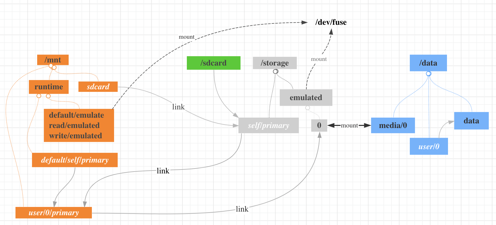

### 疑问

* Q1:  同一个文件，使用不同的路径访问时为什么 owner 和 group 不一样？

	```
	# ll /data/media/0/
	total 80
	-rw-rw-r-- 1 media_rw media_rw    0 2021-01-07 15:14 1
	drwxrwxr-x 2 media_rw media_rw 4096 2020-12-31 16:26 Alarms
	drwxrwxr-x 5 media_rw media_rw 4096 2021-01-07 15:36 Android
	...
	
	# ll /sdcard/
	total 80
	-rw-rw---- 1 root sdcard_rw    0 2021-01-07 15:14 1
	drwxrwx--x 2 root sdcard_rw 4096 2020-12-31 16:26 Alarms
	drwxrwx--x 5 root sdcard_rw 4096 2021-01-07 15:36 Android
	...
	
	```
* Q2: 在获得sdcard 读写权限后，app通过以下2种方式创建文件:
	
	```
	new File("/data/media/0/Android/test").createNewFile(); //为什么失败？
	new File("/sdcard/Android/test").createNewFile(); //成功
	```	
	

* Q3: 没有授权sdcard 权限时，以下创建文件是如何成功的？

	```
	new File("/sdcard/Android/data/$self/"+test).createNewFile();
	```	
	下面这个又是如何失败的？
	
	```
	new File("/sdcard/Android/data/$other/"+test).createNewFile();
	```
	


*  Q4: app 获取sdcard 权限之后，以sdcard 开头的路径都能够读写和修改，包括其他app的私有目录：`/sdcard/Android/data/$pkg/`。既然这样，那  `/sdcard/Android/data/$pkg/`  下面的 owner 和 group 有什么用途？
	
	```
	b-11:/ # ll /sdcard/Android/data/
	drwxrwx--x 3 u0_a7  sdcard_rw 4096 2021-01-05 11:39 com.android.appstore
	drwxrwx--x 3 u0_a21 sdcard_rw 4096 2020-12-31 16:27 com.google.android.gms
	drwxrwx--x 4 u0_a43 sdcard_rw 4096 2020-12-31 16:29 com.netease.uu
	drwxrwx--x 4 u0_a65 sdcard_rw 4096 2021-01-05 11:39 com.xmcy.hykb
	```


### sdcard 的结构

Android 系统把 `/data/media` 这个目录模拟成一个内置的sdcard， 和它对等的是 `/storage/emulated` ，以及带有不同权限的3个视图： `/mnt/runtime/default/emulated` 、 `/mnt/runtime/read/emulated` 和 `/mnt/runtime/write/emulated`

```
/data/media/0 <==> /storage/emulated/0
```



`/sdcard` 这个路径对应的到 `/dev/fuse` 设备，也就是这个路径下的文件操作走的是 fuse 这个文件系统；
`/data/media` 这个路径是真实路径，使用它直接操作文件。 所以上面的【疑问Q1】，是因为通过 `/data/media` 获取到的文件信息是真实的文件属性，而通过 `sdcard` 获取到的文件属性是 fuse 返回的文件属性（封装后的）。 

真实的文件属性， owner和group都是 `media_rw` 权限是 `drwxrwxr-x` 所以其他用户只能读，不能写。所以这就可以解释 【疑问Q2】。

```
b-11:/ # ll /data/media/0/Android/data/$pkg/
drwxrwxr-x 4 media_rw media_rw 4096 2021-01-05 11:40 files
```

以 `/sdcard` 或者 `/storage ` 开头的路径访问操作文件时，走FUSE。FUSE封装后的权限分2类：
一类是app私有目录，比如 `/sdcard/Android/data/$pkg`、 `/sdcard/Android/obb/$pkg` 它的 owner是app自己，group 是 sdcard_rw

```
ll /sdcard/Android/data/$pkg/
drwxrwx--x 4 u0_a65 sdcard_rw 4096 2021-01-05 11:40 files
```

除了app的私有目录外的文件，owner 是root，group 是 `sdcard_rw` 权限是 `drwxrwx--x` 所以，除了私有目录下的内容，app

```
b-11:/ # ll /sdcard/
drwxrwx--x 2 root sdcard_rw 4096 2020-12-31 16:26 Pictures
```

### fuse  
	
有篇文章写的不错： [引用](https://www.xda-developers.com/diving-into-sdcardfs-how-googles-fuse-replacement-will-reduce-io-overhead)

kernel 把文件操作(read/write/mkdir 等）的系统调用，透传给用户空间的 fuse 程序，对应到android，就是下面这个 sdcard 进程，这个进程是 vold 系统服务fork出来的，代码在 EmulatedVolume.cpp

```
sdcard -u 1023 -g 1023 -m -w -G /data/media emulated
```	
sdcard 进程的代码在 `/system/core/sdcard` 下面。 它会处理从 kernel 透传过来的文件操作。比如 app 打算在 sdcard 上创建一个文件，调用`openat("/sdcard/Android/data/$pkg/file")`，内核会解析出真实路径`/data/media/0/Android/data/`，然后从 `/data/media` 开始，一个个节点做检查，检查的执行者正是 `sdcard` 这个进程。 比如内核会发送 `lookup` 给`sdcard`询问子文件是否存在，或者发送 `getattr` 让 `sdcard`查找这个文件的属性。 

举个例子，比如app打算在sdcard下面创建一个文件 file：

```
new File("/sdcard/Android/data/$pkg/file").createNewFile();
```
对应的系统调用是：
```
openat(AT_FDCWD, "/sdcard/Android/data/$pkg/file", O_RDWR|O_CREAT|O_EXCL|O_LARGEFILE, 0666)
```

内核收到`openat `调用后，会向 `sdcard` 进程发送多条消息，`sdcard`进程处理这些消息，最终会通过 mknod 创建 file 这个文件：

```
GETATTR flags=0 fh=0 @ 1 (/data/media)
LOOKUP 0 @ 1 (/data/media)
LOOKUP Android @ 273693496401920 (0)
LOOKUP data @ 273693496402048 (Android)
LOOKUP com.summer.demo @ 273693496402176 (data)
LOOKUP sdcard-q2-1 @ 273693496402816 (com.summer.demo)
NOTIMPL op=35uniq=f0nid=f8ec3ba16380
MKNOD file 0100600 @ f8ec3ba16380 (com.summer.demo)
OPEN 0400002 @ f8ec3ba16c00 (sdcard-q2-1)
OPEN /data/media/0/Android/data/com.summer.demo/file
FLUSH
RELEASE 0xf8ec3ba17028(14)
```

`FUSE` 代理这些文件操作的目的是：根据app的包名，把 sdcard 划分出具有不同owner、group 和 权限的子目录。关键实现的方法在这里：

```
system/core/sdcard/fuse.cpp

static void derive_permissions_locked(struct fuse* fuse, struct node *parent,
        struct node *node) {
	...
	node->userid = parent->userid;
	node->uid = parent->uid;
	...
	
	switch (parent->perm) {
	...
	case PERM_ANDROID_DATA:
	case PERM_ANDROID_OBB:
	case PERM_ANDROID_MEDIA:
	    const auto& iter = fuse->global->package_to_appid->find(node->name);
	    if (iter != fuse->global->package_to_appid->end()) {
	        appid = iter->second;
	        node->uid = multiuser_get_uid(parent->userid, appid);
	    }
	    ...
	} 
}

static void attr_from_stat(struct fuse* fuse, struct fuse_attr *attr,
        const struct stat *s, const struct node* node) {
	...
	attr->uid = node->uid;
	if (fuse->gid == AID_SDCARD_RW) {
        attr->gid = AID_SDCARD_RW;
    } else {
        attr->gid = multiuser_get_uid(node->userid, fuse->gid);
    }
    ...

}
```

#### fuse 疑问
* 3个线程都打开了 `/dev/fuse` 那内核透传文件操作时，透传到哪个线程的？
	
	```
	
	```

基于FUSE 的工作原理，它存在以下弊端：	

1. I/O Overhead， 对比直接的文件操作，它增加了 30+% 的时间消耗，io消耗。
2. Double Caching
3. FUSE 的实现并不完美，有死锁的问题；


### 不同权限的视图

首先说一下个人对视图的理解，以及它的理论基础：linux 中，通过文件路径访问对应的文件，比如 `/storage/emulated/0/Android/1.txt` 要能成功访问这个文件，需要通过整条路径每个节点权限的检测，也就是需要 `/storage/emulated/0/Android/` 每层文件夹的 `x`权限，以及对应的 `r/w` 权限。   

所以如果1个文件只有1条路径可以访问，那么它的权限就只有1种。但如果通过 `mount` 或者 `ln` 使得一个文件有多条路径可以访问，那每条路径可以提供不同的权限，也就多了权限。 这种不同的路径就是所谓的视图。 

经过封装后的 `/data/media` 对app提供3种视图分别是:

```
drwxrwx--x 1 root sdcard_rw /mnt/runtime/default/emulated/0/
drwxrwx--- 1 root everybody /mnt/runtime/write/emulated/0/
drwxr-x--- 1 root everybody /mnt/runtime/read/emulated/0/
```

`default` 视图下，group 是 sdcard_rw ，other 用户有 `x` 权限。 所以在这个视图下的app没有权限在 `sdcard/` 下面创建和修改文件，但能够在自己的私有路径下创建和修改文件，因为私有路径的owner是app自己， 这也就解释了 【疑问Q3】，没有sdcard 权限时，app只能在自己的私有路径下创建和修改文件。这也是 fuse 封装 owner 的唯一作用。

`read` 和 `write` 视图group 是 `everybody`。关于 `everybody` 这个用户组，它的gid是 9997，通过它的名字就可以知道，所有app都在这个用户组里面。通过查看 `/proc/$pid/status` 就可以知道：

```
b-11:/ # id everybody
uid=9997(everybody) gid=9997(everybody) groups=9997(everybody)
b-11:/ # cat /proc/3890/status
Groups:	3003 9997 20064 50064
```
也就是只要app在这个视图下，那它就可以读/写 `/storage/emulated/0`，意味着可以遍历、创建和修改文件，包括其他app的私有路径。所以 `/sdcard/Android/data/$pkg`下的私有路径比起 `/data/data/$pkg` ，安全性是比较弱的，因为其他有sdcard访问权限的app也能够读写。官方文档有[说明](https://developer.android.com/training/data-storage/app-specific)。

### sdcard 动态授权

[引用](https://codar.club/blogs/android-fuse-and-runtime-permissions.html)

`sdcard` 的动态授权其实就是动态改变了 app 的 sdcard 权限视图， 授权过程是从  `/mnt/runtime/default` 切换到 `/mnt/runtime/read` 或者 `/mnt/runtime/write`。“切换”的实现其实就是 `mount`。 下面简单整理一下代码流程。

1. zygote fork 出来的每个进程都有自己的mount命名空间，根据进程被fork时的sdcard权限，把 /storage mount 到不同权限的 /mnt/runtime/default 、/mnt/runtime/read 和 /mnt/runtime/write ，这样不同权限的进程的 /storage 对应的权限是不一样的，代码在：

	```
	frameworks/base/core/jni/com_android_internal_os_Zygote.cpp
	
	static bool MountEmulatedStorage(uid_t uid, jint mount_mode,
        bool force_mount_namespace) {
		... 
		String8 storageSource;
		if (mount_mode == MOUNT_EXTERNAL_DEFAULT) {
		    storageSource = "/mnt/runtime/default";
		} else if (mount_mode == MOUNT_EXTERNAL_READ) {
		    storageSource = "/mnt/runtime/read";
		} else if (mount_mode == MOUNT_EXTERNAL_WRITE) {
		    storageSource = "/mnt/runtime/write";
		} else {
		    // Sane default of no storage visible
		    return true;
		}
		if (TEMP_FAILURE_RETRY(mount(storageSource.string(), "/storage",
		        NULL, MS_BIND | MS_REC | MS_SLAVE, NULL)) == -1) {
		    ALOGW("Failed to mount %s to /storage: %s", storageSource.string(), strerror(errno));
		    return false;
		}
		...    
   }
   
	```

2. 当用户授权app访问sdcard后，PMS向vold发送remount这个uid的指令， vold 遍历 /proc 目录找到所有以 uid 用户运行的进程对应的 /proc/$pid/ns/mnt ，然后创建一个子进程，让子进程通过 setns 进入这个mount命名空间，进入命名空间后，再remount /storage 的路径，这样就不用重启进程了：

	```
	frameworks/base/services/core/java/com/android/server/pm/PackageManagerService.java
	
	grantRuntimePermission
		--> onExternalStoragePolicyChanged
    		-->remountUidExternalStorage
       		-->mConnector.execute("volume", "remount_uid", uid, modeName);
       		
    
   system/vold/VolumeManager.cpp
   int VolumeManager::remountUid(uid_t uid, const std::string& mode) {
   		...
   		if (!(dir = opendir("/proc"))) {
	        PLOG(ERROR) << "Failed to opendir";
	        return -1;
	   }
	   ...
	    // Poke through all running PIDs look for apps running as UID
	    while ((de = readdir(dir))) {
	    	if (!(child = fork())) {
				if (setns(nsFd, CLONE_NEWNS) != 0) {
				    PLOG(ERROR) << "Failed to setns for " << de->d_name;
				    _exit(1);
				}
				...
				std::string storageSource;
				if (mode == "default") {
				    storageSource = "/mnt/runtime/default";
				} else if (mode == "read") {
				    storageSource = "/mnt/runtime/read";
				} else if (mode == "write") {
				    storageSource = "/mnt/runtime/write";
				} else {
				    // Sane default of no storage visible
				    _exit(0);
				}
				if (TEMP_FAILURE_RETRY(mount(storageSource.c_str(), "/storage",
				        NULL, MS_BIND | MS_REC, NULL)) == -1) {
				    PLOG(ERROR) << "Failed to mount " << storageSource << " for "
				            << de->d_name;
				    _exit(1);
				}
				...
			}
		}//while
   }
   
	```

### Android11

Android11 把 /sdcard/Android/data 和 /sdcard/Android/obb 重新mount回 /data/media/0/Android/data
和 /data/media/0/Android/obb， 这样当app访问这2个目录的文件时就不再走 fuse， 代码在这里：

```
vold/model/EmulatedVolume.cpp
status_t EmulatedVolume::mountFuseBindMounts() {
	...
	std::string androidDataSource = StringPrintf("%s/data", androidSource.c_str());
	std::string androidDataTarget(
	        StringPrintf("/mnt/user/%d/%s/%d/Android/data", userId, label.c_str(), userId));
	status = doFuseBindMount(androidDataSource, androidDataTarget, pathsToUnmount);
	...
	std::string androidObbSource = StringPrintf("%s/obb", androidSource.c_str());
	std::string androidObbTarget(
	        StringPrintf("/mnt/user/%d/%s/%d/Android/obb", userId, label.c_str(), userId));
	status = doFuseBindMount(androidObbSource, androidObbTarget, pathsToUnmount);
	...
}
```


裸路径信息：

```
/data/media/0/ ()
	Android/ (771 media_rw media_rw)
		data/ (771 media_rw ext_data_rw)
		obb/	 (771 media_rw ext_obb_rw)
```

视图路径权限：

```
/mnt/ (750,root, media_rw)
	user/0/	(710, root, everybody)
		emulated/ (700, root, root)
		self/	(755, root, root)
			primary -> /storage/emulated/0
	pass_through/0/ (710, root, media_rw)
		emulated/	(710, root, media_rw)
		self/	(710, root, media_rw)
			primary -> /storage/emulated/0
	
```


